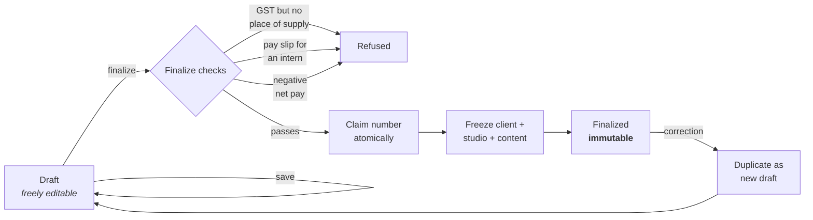

# speclr

**Qera Studio's internal operations tool.** It issues the documents a studio is legally on the hook for — invoices, receipts, contracts, pay slips, HR letters — and validates icon specs on the side.

The documents it produces are real. They go to real clients and a real employee, they get filed with real tax returns, and one of them may be pulled out of an archive six years from now by someone who is not in a good mood. That single fact is the reason this codebase looks the way it does.

<sub>Next.js 16 · React 19 · TypeScript (strict) · Tailwind v4 · shadcn/ui · Neon Postgres · Drizzle · Clerk · Zod · Jest + RTL · 1,068 tests</sub>

---

## Contents

- [What it does](#what-it-does)
- [The eight documents](#the-eight-documents)
- [Six rules that explain the whole codebase](#six-rules-that-explain-the-whole-codebase)
- [The other tools](#the-other-tools)
- [Architecture](#architecture)
- [The print pipeline](#the-print-pipeline)
- [Data model](#data-model)
- [Security](#security)
- [Getting started](#getting-started)
- [Scripts](#scripts)
- [Testing](#testing)
- [The standards this ships under](#the-standards-this-ships-under)
- [Where the documentation lives](#where-the-documentation-lives)
- [Status](#status)

---

## What it does

Pick a document type. Pick a client or an employee. Fill in the parts that vary. Watch it typeset itself into an A4 page, one page at a time, in a preview that is the actual print artifact rather than an approximation of it. Save it as a draft as many times as you like. Then **finalize** — and it turns to stone: a number claimed atomically from a per-financial-year sequence, the client frozen into it, the studio's own address frozen into it, every word of its legalese frozen into it, and every edit and delete control gone from the UI because the persistence layer would refuse them anyway.

That's the tool. The interesting part is everything the word *finalize* has to guarantee.

speclr was extracted from the qera.studio marketing site, where it lived as a pair of routes (`/kessler-admin`, `/kessler-spec`) on top of Upstash Redis. It was rebuilt here on Postgres, Clerk and shadcn as a standalone app. The domain layer came across nearly verbatim, and its tests came across *exactly* verbatim — they pass unchanged, which is the proof the core survived the move.

---

## The eight documents

| | Type | Kind | Numbered | About |
|---|---|---|---|---|
| `INV` | Invoice | financial | `QS-INV-2627-001` | Line items, GST, due date, place of supply |
| `REC` | Receipt | financial | `QS-REC-2627-001` | Payment method, reference, the invoice it settles |
| `CON` | Contract | contract | — | A 24-clause MSA plus any number of service schedules |
| `STP` | Stipend slip | hr-slip | `QS-STP-2627-001` | A *voluntary* record of a discretionary payment to an intern |
| `PAY` | Pay slip | hr-slip | `QS-PAY-2627-001` | A *statutory* wage record — itemised deductions, days paid, LOP |
| `OFR` | Offer letter | hr-letter | — | Salary quoted annually for an employee, monthly for an intern |
| `EXP` | Experience letter | hr-letter | — | |
| `EXIT` | Exit letter | hr-letter | — | Auto-switches between two legally distinct documents (see below) |

Contracts and letters carry no number because nothing requires them to. Invoices do, and the requirement is specific enough to have shaped the database.

A new type is one entry in [`registry.ts`](src/lib/domain/registry.ts) — its slug, masthead, kind, Zod draft and finalize schemas, default fields and fixed TERMS clauses. Storage, auth and numbering don't move.

---

## Six rules that explain the whole codebase

If any of the code below looks like over-engineering, it's one of these six.

### 1. Money is integer paise

₹1 = 100 paise, stored and computed as integers, everywhere. There is no float anywhere near a total. `rupeesToPaise` / `paiseToRupees` / `formatINR` / `amountInWords` are the only ways in and out. A float that rounds a rupee wrong is not a bug you notice — it's a bug an accountant notices, eighteen months later, in a filing.

### 2. Numbering is atomic, per financial year, and never duplicates

`QS-INV-2627-001` — Indian financial year (April–March), FY 2026-27 → `2627`, sequential per (type, FY).

The number is claimed **at finalize**, from a `counters` table, under a row lock. Not at draft creation. So an abandoned draft never burns a number, and two people finalizing at the same instant cannot collide. A **gap** in the sequence is acceptable; a **duplicate is never** — GST Rule 46 requires consecutive unique invoice numbers, and there is a `UNIQUE` index on `documents.number` standing behind the application logic in case the application logic is ever wrong.

### 3. Finalized means immutable

Once finalized, a document cannot be edited, overwritten or deleted. Enforced in the persistence layer, not just hidden in the UI. A correction is made by duplicating the document as a fresh draft and issuing that — which is what a paper trail is.

### 4. The snapshot pattern

At finalize, the document freezes:

- **the client** (or the employee) into a JSONB snapshot,
- **the studio** — Qera's own address, GSTIN, CIN, bank — into a second one,
- **every word of its content** — mastheads, subject lines, TERMS clauses, all 24 MSA sections — into a third.

Editing a client next year must not rewrite an invoice issued this year. Moving office must not rewrite the supplier address on invoices already filed — CGST s.36 requires a tax invoice be retained *unaltered* for 72 months, and Rule 46 wants the address as at issue. Revising a contract clause must not silently amend contracts already signed.

Sheets read `studioOf(doc)` and `contentOf(doc, spec)`, never the live settings row and never the constants. If you ever make them read the constants directly again, you have created a compliance bug.

### 5. Every printed word is content, and content is editable

Every line that carries *meaning* is editable per document: mastheads, the letter subject, TERMS clauses, the MSA's 24 sections, the signatory block, footer identity lines. Structural labels — `DESCRIPTION`, `Subtotal`, `GSTIN:` — are not: they are the document's grammar, and Rule 46 expects several of them verbatim.

A draft stores **only what was actually edited**, so an untouched document prints exactly what it always printed. Clearing a field to empty is an *override*, not a reset — the document prints nothing there, because that is the honest reading of an empty input.

### 6. Intern and employee are legally different people

Not a display flag. `engagementType` branches real legal content:

- The **exit letter** becomes an *Internship Completion Letter* for an intern and a *Relieving Letter* for an employee. An intern is never "relieved from services", never "resigned", and an internship document must contain no employment or salary language.
- The **stipend slip** exists partly to *deny* an employment relationship. The **pay slip** is a statutory wage record under the Code on Wages 2019 and Payment of Wages Act s.13A, which is why it alone carries itemised deductions, days worked/paid/LOP, and the statutory identifiers (employee code, PAN, UAN, PF, ESIC).
- A pay slip **cannot be finalized for an intern**. Net pay **cannot be negative** at finalize — no lawful deduction leaves someone owing their wages back.
- Employee codes (`QS-EMP-001`) are **assigned, never typed**, from the same atomic counter as document numbers — and only to employees, because an intern is not on the payroll. A code, once held, is never reassigned: it is frozen onto every slip already issued to that person.
- Assertions whose truth depends on the case — "no TDS applicable", "dues settled" — are editable inputs, not boilerplate. The pay slip's deductions note defaults to **empty**, because "no statutory deductions apply" is a claim about someone's tax position that stops being true the moment TDS u/s 192 does.

And a seventh, smaller one: dates print as **"10th June 2026"**, never `10/06/2026`, everywhere, via the `dates` helpers.

---

## The other tools

**Icon & Logo Spec** (`/spec`) — upload each favicon/OG asset variant and check it against 11 specs, with live previews in the contexts that actually matter: a browser tab, an iOS home screen, a Google SERP result, a social card, a maskable safe-zone. It parses `.ico` containers, runs SVG hygiene checks, and grades quality. Entirely client-side, holds no financial data, works for any brand — the one part of speclr that could safely be made public one day.

**CTC calculator** (`/tools/ctc`) — annual cost to company in, a monthly salary structure out, reading top-down with every list summing exactly to the total above it. It deliberately **writes nothing**: you type the result into a pay slip yourself, because the slip's line items are the record and a figure that appears because a tool produced it looks more authoritative than it is.

**Kit** (`/kit`) — every colour token, button, badge and control the app is allowed to use, on one page. A route rather than a Storybook instance, so it builds with the real Tailwind config and the real theme tokens: what it shows is what ships, with no second build to keep alive. The rule it documents is *enforced* by [`design-tokens.test.ts`](src/__tests__/design-tokens.test.ts), not by the page.

Plus two thin server-side proxies — `/api/ifsc/[code]` and `/api/pincode/[code]` — which keep the upstream hostname out of the client, check the session first (this is an internal tool, not an open proxy), and **always fail silently with `200 { ok: false }`**, because every field they fill is editable by hand and a lookup outage must never stop someone saving.

---

## Architecture

```
form → Zod validate → Server Action → Drizzle → Postgres
                           ↑
                    Clerk session + email allowlist,
                    verified server-side, every time
```



```
src/
├── lib/domain/     The portable core. Pure TypeScript, zero UI, zero framework.
│                   money · dates · amountInWords · gstStates · registry · studio
│                   employee · employeeCode · salaryStructure · hrContent
│                   msaBoilerplate · docContent · docNumber · address · phone · bank
│                   Its tests came from the source project verbatim and must
│                   pass unchanged.
├── db/             Drizzle schema, queries, mappers, migrations, the atomic counter.
├── server/actions/ Server Actions — documents, clients, employees, services,
│                   studio, address, search. Each verifies the session itself.
├── components/
│   ├── docs/
│   │   ├── sheets/   The pixel-faithful print artifacts. Pure data → markup.
│   │   ├── editors/  The form rails beside each preview.
│   │   └── ...       DocumentWorkspace, DocumentPreview (the paginator),
│   │                 PrintToolbar, FinalizedActions.
│   ├── admin/      Dashboard, sidebar, tables, the ⌘D new-document palette.
│   ├── spec/       The icon tool.
│   ├── tools/      The CTC calculator.
│   ├── form/       Shared form primitives.
│   └── ui/         shadcn, owned in-repo (new-york / base-mira).
├── app/
│   ├── (admin)/    Everything behind the two locks.
│   ├── api/        The IFSC and PIN-code proxies.
│   ├── sign-in/    Clerk.
│   └── no-access/  Where a signed-in but non-allowlisted user lands.
└── styles/         Tailwind, plus print.css for what Tailwind can't express.
```

**Server Components by default.** `'use client'` only where the browser is genuinely needed. React Compiler is on — which means a plain impure function called during render caches its first result for ever, so don't write one.

**shadcn first.** No hand-rolled button, input, select, dialog or table. `AlertDialog`, never `Dialog`, for anything destructive. Theme tokens (`bg-background`, `text-foreground`, `border-border`), never ad-hoc hex — and there is a test that fails if you use one.

**The sheets are finished artifacts.** They reproduce approved legal documents exactly and are not redesigned. Only their styling system changed in the move (SCSS → Tailwind + `print.css`). Everything *around* them is fresh shadcn, which is where shadcn earns its keep.

---

## The print pipeline

Each sheet exposes its content as a **flat list of atomic blocks** — the cover, the parties grid, one MSA clause, one schedule, the signatures. Nothing in that list may be split.

[`DocumentPreview`](src/components/docs/DocumentPreview.tsx) — one pagination engine for all eight types — measures every block and packs them into fixed A4 frames, breaking only *between* blocks, so a clause heading never separates from its body. A block taller than a page gets its own page and is allowed to overflow rather than be sliced: deterministic, never mangled. On screen the pages stack and scroll vertically like a PDF viewer, with zoom and the page counter owned by the workspace bar. A cover block can be pinned as its own full-bleed first page — the black contract and offer-letter covers. For print and PDF the same blocks flow through real CSS page breaks in `print.css`.

Sheets stay pure `data → markup`, which keeps a future server-side PDF renderer a purely additive upgrade.

> **jsdom cannot see layout.** It cannot see a page break, an overflow, or a clipped row. Pagination and print changes are verified in a real browser — the stipend/pay slip sheet in particular uses a fixed single A4 frame that *clips*, and a clipping bug has slipped past a green test suite here before.

---

## Data model

Relational columns for what gets queried and reported on; JSONB for the parts that vary by document type. Every JSONB payload is Zod-validated on write — the shape is never trusted.

| Table | Holds |
|---|---|
| `clients` | Short `name` for lists, legal `companyName` for documents, structured address, GSTIN |
| `employees` | Engagement type, pay (annual for employees, monthly stipend for interns), payroll identifiers, the generated employee code behind a partial unique index |
| `service_templates` | Reusable named blocks of work — scope, exclusions, milestones, pricing — that seed a contract schedule as a detached copy |
| `studio_settings` | Qera's own identity, editable at `/settings`, snapshotted onto every document at finalize |
| `documents` | Type, status, number/serial/FY, issue and due dates, FK to client *or* employee, GST rate, place of supply, total in paise, the JSONB payload, the frozen snapshot, and a `created_by` / `finalized_by` audit trail |
| `counters` | One row per (doc type, FY code) holding the last serial. The atomic claim. |

Money is `integer` paise. Document dates are ISO `YYYY-MM-DD`. Row lifecycle uses `timestamptz`. Schema changes go through drizzle-kit migrations — never by hand against the database.

---

## Security

Two independent locks, both marked *do not weaken*:

1. **Clerk sign-up is Restricted.** Invite-only. The public cannot self-register; accounts exist only if created from the Clerk dashboard.
2. **A fail-closed email allowlist.** `SPECLR_ALLOWED_EMAILS`, comma-separated. Every protected page and action calls `requireAuthorizedUser()` — valid session **and** allowlisted email. An empty allowlist admits nobody. A signed-in but non-allowlisted user lands on `/no-access` and sees zero documents.

Adding a person means doing both: invite them in Clerk *and* add their email to the allowlist, in `.env.local` and in Vercel.

The floor underneath it, from the security checklist:

- **Never trust the client; verify ownership server-side.** A layout is not a security boundary.
- Secrets live in env vars. Never in git. Never `NEXT_PUBLIC_`-prefixed.
- Every table gets ownership/access enforcement, even though every invited user currently has full access.
- Internal pages are `robots: { index: false, follow: false }` and absent from any sitemap.

---

## Getting started

**You'll need:** Node 20+, a Neon Postgres database, and a Clerk application.

```bash
git clone git@github.com:Qera-Studio/Speclr.git
cd speclr
npm install
```

Copy the environment template and fill it in:

```bash
cp .env.example .env.local
```

```ini
DATABASE_URL=                        # Neon
NEXT_PUBLIC_CLERK_PUBLISHABLE_KEY=   # Clerk
CLERK_SECRET_KEY=                    # Clerk
SPECLR_ALLOWED_EMAILS=you@example.com  # by hand — empty admits nobody
```

The first three are provisioned by the Vercel integrations and can be pulled with `npx vercel env pull .env.local`. The allowlist is always set by hand.

Apply the migrations, then run it:

```bash
# drizzle-kit reads process.env, and auto-loads .env but not .env.local
env $(grep -v '^#' .env.local | xargs) npx drizzle-kit migrate

npm run dev
```

http://localhost:3000 — sign in with an email that is both invited in Clerk and on the allowlist.

---

## Scripts

| | |
|---|---|
| `npm run dev` | Development server (Turbopack) |
| `npm run build` | Production build |
| `npm start` | Serve the production build |
| `npm test` | The suite — **1,068 tests across 119 files** |
| `npm run test:watch` | Watch mode |
| `npm run test:int` | Integration tests against a real database (`RUN_INTEGRATION=1`, serial) |
| `npm run typecheck` | `tsc --noEmit` |

---

## Testing

Jest + React Testing Library. Roughly **13,700 lines of test to 27,600 lines of source**, which is about the ratio you want when the output is a tax document.

- Every component and every non-trivial module has tests in a `__tests__/` directory beside it.
- `getByRole` over `getByTestId` — roles are what assistive tech actually sees.
- `userEvent.setup()`, imported statically. Not `fireEvent`.
- Test behaviour visible to users and assistive tech, not implementation details.
- The domain tests were lifted verbatim from the source project and **must pass unchanged**. Do not weaken them.
- jsdom cannot validate print or pagination. Use a browser.

**A task is not complete until the code is written, the tests are written, and `npm test` passes with no failures.**

---

## The standards this ships under

Eight master checklists live in [`dev/`](dev/) — built on OWASP ASVS / Top 10 and multi-domain synthesis. They are the production standard, not suggestions, and they travel to every Qera project.

**Precedence, highest first:** Legal → Security → Accessibility → Backend → Performance → SEO → Design.

| Checklist | Owns |
|---|---|
| [Legal & compliance](dev/master-legal-compliance-checklist.md) | Privacy, data deletion, licensing, dark patterns, jurisdiction. Highest stakes here. |
| [Security](dev/master-security-checklist.md) | Auth, IDOR, secrets, RLS, validation, headers, rate limiting |
| [Accessibility](dev/master-accessibility-checklist.md) | WCAG 2.1 AA — semantic HTML, keyboard, focus, ARIA |
| [Backend](dev/master-backend-checklist.md) | Correctness, data integrity, code craft, coding-with-AI discipline |
| [Performance](dev/master-performance-checklist.md) | Core Web Vitals, bundle, loading |
| [SEO](dev/master-seo-checklist.md) | Mostly moot — speclr is `noindex` — but kept as the standing set |
| [Design & brand](dev/master-design-brand-checklist.md) | Adapted to the shadcn design language |
| [Launch readiness gate](dev/master-launch-readiness-gate.md) | The go/no-go ritual before every production deploy |

---

## Where the documentation lives

Four files, four different jobs, deliberately not overlapping:

| File | Answers |
|---|---|
| **README.md** | *What is this?* — you are here |
| [**CONTEXT.md**](CONTEXT.md) | *Why is it shaped this way?* — the domain rules and the decisions already made, so they don't get re-litigated |
| [**AGENTS.md**](AGENTS.md) | *How do I work in it?* — the standards, stack and coding rules |
| [**ROADMAP.md**](ROADMAP.md) | *What isn't built yet?* — the single home for unbuilt work, including everything deliberately deferred |

Design specs and implementation plans live in [`docs/superpowers/`](docs/superpowers/). The migration runbook is at [`docs/MIGRATION_RUNBOOK.md`](docs/MIGRATION_RUNBOOK.md).

---

## Status

In active use. Eight document types shipped and issuing.

The near-term list — a full-view editor, a second sidebar panel, admin roles, public access for the icon tool, a client database and portal — is in [`ROADMAP.md`](ROADMAP.md), along with the hiring flow that would add three more document types, and the things deliberately *not* built: a server-side PDF renderer, and any kind of payroll engine (EPF needs 20+ employees, ESI needs 10+ and gross ≤ ₹21,000, and UP has no Professional Tax — so for a studio this size the only live statutory deduction is TDS, and a free list of deduction lines covers it).

Two known issues, both documented in `CONTEXT.md`: `npm audit` flags transitive advisories bundled inside Next.js — **do not `audit fix --force`**, it downgrades Next 16 to 9.3.3 — and the Clerk keys are still a dev instance, so production login needs a production instance before go-live.

---

<sub>© Qera Studio. Private and unlicensed — all rights reserved.</sub>
